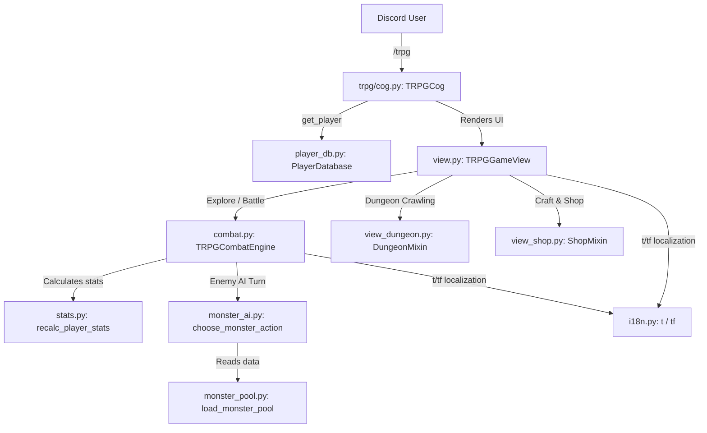

# BabaBot Wiki & Architecture Reference

> **Generated architecture snapshot**: This file is regenerated from the repository structure and may become stale after code changes. Treat source code, tests, and runtime checks as authoritative. Links are repository-relative so the Wiki works after cloning on another computer.
>
> BabaBot currently contains its Discord bot and TRPG systems. The separate 求生意志 web game is not part of this repository. A future `Baba SurvivingWill` mini-game or web-link integration is only a possible extension, not current functionality.

---

## 1. Executive Summary & Core Stack

- **Purpose**: BabaBot is a feature-rich Discord bot powered by `discord.py`, including a text-based TRPG system with turn-based combat, character progression, skills, equipment crafting, dungeon crawling, random events, and multi-language support (English & 繁體中文). This is separate from the friend's 求生意志 web game.
- **Core Stack**:
  - **Bot Framework**: Python 3.11+, Discord.py 2.x, `discord.ext.commands`, Slash commands (`app_commands`).
  - **Database / Persistence**: SQLite + JSON fallback ([player_db.py](../trpg/player_db.py#L12) storing players & active slots).
  - **i18n**: Multi-language localization system via [i18n.py](../trpg/i18n.py#L34).

---

## 2. Component Sitemap & Function Links

### A. Discord Bot Entry Point & Cog Loader
- **[main.py](../main.py#L1)**: Entry point configuring logging, discord intents, bot initialization, cog loading, and error handling.
- **[monitor_cog.py](../monitor_cog.py#L1)**: In-process health monitoring and crash detection.
- **[response_cog.py](../response_cog.py#L1)**: AI response generator for NPC dialogue & chat.

### B. BabaBot TRPG Core Modules
- **[TRPGCog](../trpg/cog.py#L32)**: Main Discord extension registered under `/trpg` and `/language`.
  - **[start_trpg](../trpg/cog.py#L357)**: `/trpg` command — launches or resumes the interactive adventure UI panel.
  - **[get_player](../trpg/cog.py#L329)**: Loads or initializes player data for active character slots.
  - **[set_language](../trpg/cog.py#L391)**: `/language` command — switches display language (`zh` / `en`).
  - **[generate_npc_dialogue](../trpg/cog.py#L350)**: Integrates AI dialogue generation for town NPCs.

### C. Combat Engine & Monster AI
- **[TRPGCombatEngine](../trpg/combat.py#L25)**: Core turn-based battle engine executing actions, elemental effects, damage mitigation, and status ailments.
  - **[execute_player_attack](../trpg/combat.py#L142)**: Basic physical/elemental attack calculations.
  - **[execute_skill](../trpg/combat.py#L292)**: Skill execution pipeline (cost validation, cooldowns, status application).
  - **[execute_monster_turn](../trpg/combat.py#L480)**: Evaluates monster AI decisions and executes enemy attacks.
- **[choose_monster_action](../trpg/monster_ai.py#L120)**: Intelligent monster AI behavior tree deciding skills, phase transitions, and target selection.
- **[load_monster_pool](../trpg/monster_pool.py#L15)**: Loads enemy statistics, boss mechanics, and drop tables from `trpg_data/monsters.json`.

### D. Character Stats, Classes & Archetypes
- **[TRPGPlayer](../trpg/player.py#L10)**: Player character schema (level, XP, HP/MP, stat points, inventory, equipment, skills).
- **[recalc_player_stats](../trpg/stats.py#L45)**: Recalculates base & gear stats based on allocated stream points (Warrior, Rogue, Mage, Warlock).
- **[migrate_player_stats](../trpg/stats.py#L120)**: Handles stat/skill migrations upon updates or balance patches.
- **[archetypes.py](../trpg/archetypes.py)**: Defines class specializations (Warrior, Rogue, Mage, Warlock) and passive bonuses.

### E. Dungeon Crawling & Procedural Floor Runs
- **[DungeonMixin](../trpg/view_dungeon.py#L17)**: Handles procedural dungeon floor navigation, room selection, and floor boss events.
  - **[build_dungeon_menu](../trpg/view_dungeon.py#L21)**: Renders the active dungeon room UI.
  - **[handle_dung_door](../trpg/view_dungeon.py#L88)**: Processes door choices (combat, treasure, mystery room, rest site).
  - **[on_dungeon_victory](../trpg/view_dungeon.py#L247)**: Resolves floor completion, rewards, and relic picks.

### F. Interactive Discord UI Views & Layouts
- **[TRPGGameView](../trpg/view.py#L125)**: Main UI view container hosting interactive Discord buttons, drop-down menus, and modals.
  - **[build_main_menu](../trpg/view.py#L546)**: Renders central hub menu (Village, Subarea Exploration, Quest Hall, Guild, Church).
  - **[handle_battle_attack](../trpg/view.py#L1600)**: UI callback for combat attack action.
  - **[handle_use_skill](../trpg/view.py#L1617)**: UI callback for skill selection and targeting.
  - **[handle_stat_alloc_menu](../trpg/view.py#L1810)**: UI panel for distributing stat points across classes.
- **[ShopMixin](../trpg/view_shop.py#L29)**: Handles Blacksmith, Merchant, Artisan crafting, and equipment upgrades.
- **[TutorialMixin](../trpg/view_tutorial.py#L17)**: Guided onboarding flow for new players.

### G. Other BabaBot Feature Cogs
- **[music_cog.py](../music_cog.py#L1)**: Voice channel music playback and queue management.
- **[poker_cog.py](../poker_cog.py#L1)** & **[blackjack_cog.py](../blackjack_cog.py#L1)**: Casino mini-games.
- **[wordle_cog.py](../wordle_cog.py#L1)** & **[lottery_cog.py](../lottery_cog.py#L1)**: Wordle puzzle & server lottery features.

---

## 3. Function Call Reference Graph for BabaBot TRPG

---

## 4. Operational Instructions for AI Agents

1. **Before editing BabaBot TRPG combat logic**: Inspect [combat.py:execute_skill](../trpg/combat.py#L292) and [stats.py:recalc_player_stats](../trpg/stats.py#L45) first.
2. **Before adding new skills or items**: Update `trpg_data/skills.json` or `trpg_data/items.json`, then check [i18n.py:tf](../trpg/i18n.py#L43).
3. **Before editing UI buttons/views**: Inspect [view.py:TRPGGameView](../trpg/view.py#L125) and [views/base.py:TRPGBaseView](../trpg/views/base.py#L4).
